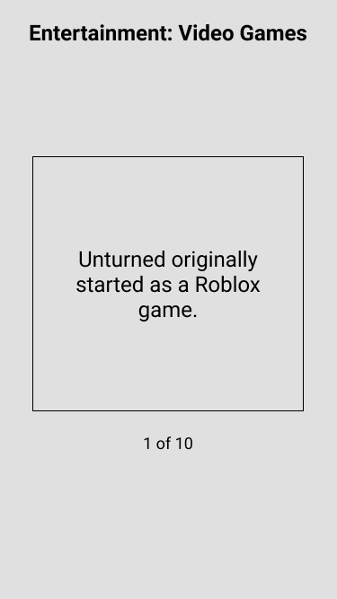

# Challenge

This project was generated with [Angular CLI](https://github.com/angular/angular-cli) version 10.1.4.

## Development server

Run `ng serve` for a dev server. Navigate to `http://localhost:4200/`. The app will automatically reload if you change any of the source files.

## Code scaffolding

Run `ng generate component component-name` to generate a new component. You can also use `ng generate directive|pipe|service|class|guard|interface|enum|module`.

## Build

Run `ng build` to build the project. The build artifacts will be stored in the `dist/` directory. Use the `--prod` flag for a production build.

## Running unit tests

Run `ng test` to execute the unit tests via [Karma](https://karma-runner.github.io).

## Running end-to-end tests

Run `ng e2e` to execute the end-to-end tests via [Protractor](http://www.protractortest.org/).

## Further help

To get more help on the Angular CLI use `ng help` or go check out the [Angular CLI README](https://github.com/angular/angular-cli/blob/master/README.md).

# Front Coding Challenge

## Overview

Your main goal is to create a 11 question quiz, with true or false answers in the technology you are applying to work in. 
**You should not just implement the most basic solution. This is a chance to show off your abilities and impress.**

## How to deliver the challenge
Please create a code repository and send a public link to juan.lopez@mocionsoft.com
with: ###CodeChallenge [jobOfer] email subject thats It.
Estimated time to complete the challenge is one day.

**The final result code will be reviewed agains:**

- Functionality
- Code Format
- Project Structure
- Scalability
- Maintainability
- Use of best practices
- State management
- Side effects handling
- Documentation

## Goals

Implement the screens based off the wireframes and api below. Note that the wireframes may not be complete, so use your best judgment for UI/UX implementation. **Do not use a boilerplate like React Boilerplate or Ignite for this challenge.** We want to see how you structure your project and what tooling you use from scratch. Create react app is fine to use. React Native projects should use the Expo CLI workflow: https://facebook.github.io/react-native/docs/getting-started

## Specifications

Data:

The api url is: https://opentdb.com/api.php?amount=10&difficulty=hard&type=boolean

Sample returned json:

```javascript
{
  "response_code": 0,
  "results": [
    {
      "category": "Entertainment: Video Games",
      "type": "boolean",
      "difficulty": "hard",
      "question": "Unturned originally started as a Roblox game.",
      "correct_answer": "True",
      "incorrect_answers": [
        "False"
      ]
    },…]}
```

### Intro / Home Screen:


- Static Text
- BEGIN button navigates to the Quiz screen and starts the Quiz

### Quiz Screen:



- The headline is from question category
- The card element contains the current question
- The next question should appear after the current question is answered True or False
- After all questions have been answered, navigate to the Results Screen

### Results screen:


- The Score shows correct and total
- Displays a list of the questions and whether the answer was correct or not
- PLAY AGAIN starts over and navigates to the Home Screen


